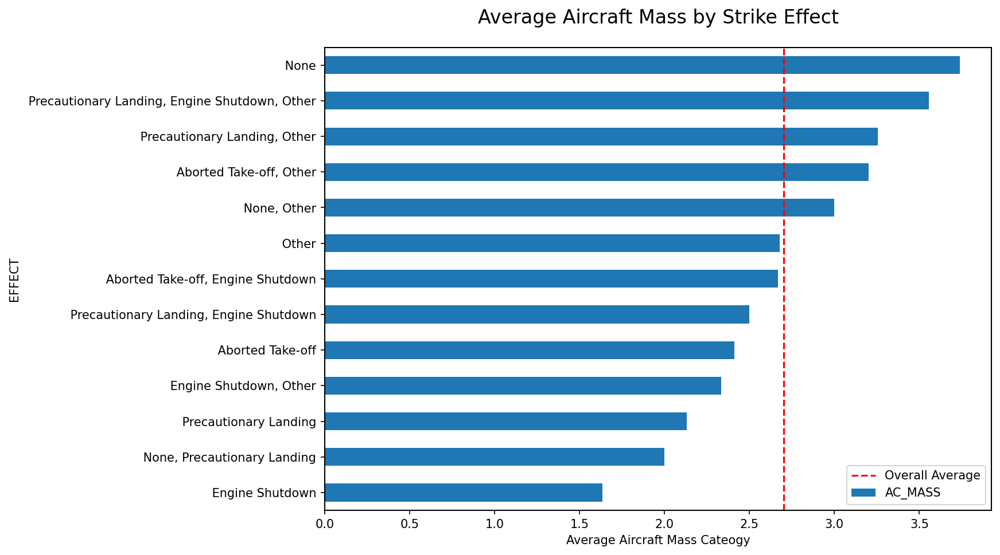
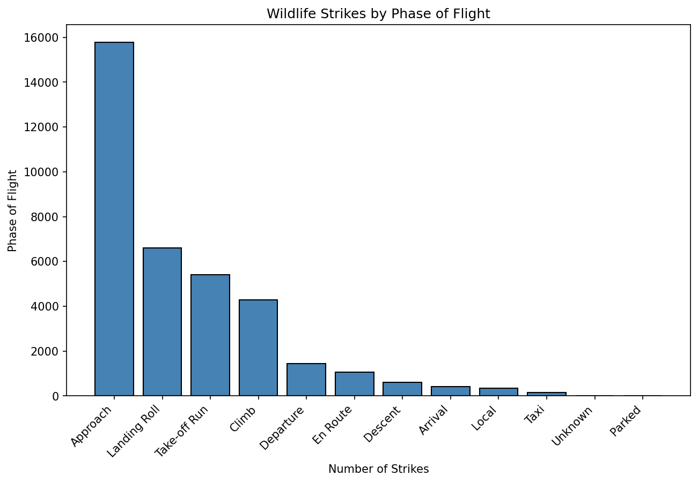
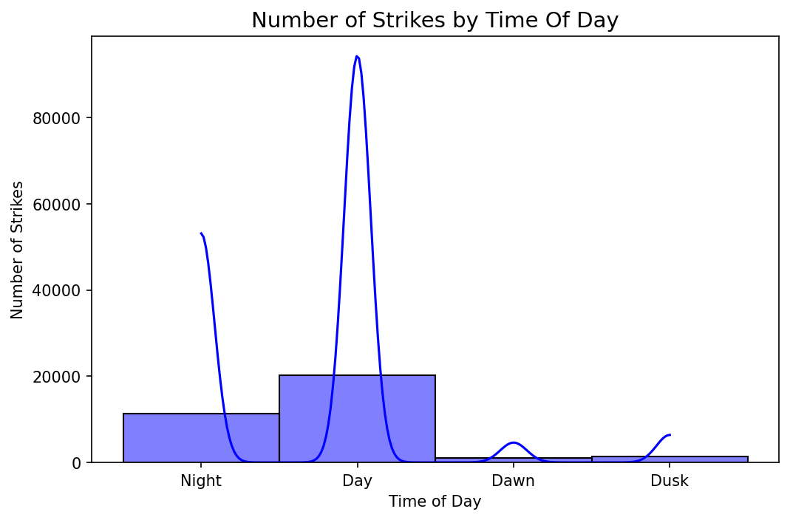

# FAA Wildlife Strike Analysis
Wildlife strikes post a real and recurring risk to aviation safety. This project analyzes the FAA Wildlife Strike Database to explore patterns in wildlife-aircraft collisions across the United States. Using incident reports collected from airport nationwide, the analysis examines where, when, and under what conditions strikes are most likely to occur - and what effect they have on flight safety outcomes.

This project is also a personal exploration of the safety outcomes for this very specific type of air incident because I do not like to fly and am looking to the powers of data analysis to understand the risks of flying and how it may just be all in my head.

# Data Source
* [**Federal Aviaiton Administration Wildlife Strike Database**](https://wildlife.faa.gov/home)
* Clicking **Search the Database** will take you to the database dashboard where you can refine your search.
* The data involved in this project are from 2023 to 2025.
    * **Note** - These database downloads can be very large, the data for this project is 78 MB.
# Key findings or ouputs
**Aircraft Mass and Strike Severity**
Smaller aircraft suffer more severe consequences from strikes. Engine shutdowns are more prevelant when looking at aircraft with smaller mass categories, while larger aircraft more frequently report no effect. This suggests that strike risk is universal but strike consequences is heavily impacted by the size of the aircraft.

**Strike Phase Distribution**
The majority of strikes occur during the points when the aircraft is in low-altitude phases (Approach, Landing Roll, and Take-off Run) which aligns with expected wildlife activity patterns near airports. The volume of En Route strikes is an outlier worth investigating further, likely explained by the species of birds that can achieve that height.

**Time of Day Risk**
Daytime has the highest strike count, but nightime stikes are also high relative to the reduced operational window.

**Species Profile**
The most commonly struck species are small birds (mourning doves, barn swallows, horned larks) due to volume and aiport proximity. However the most costly strikes involve large species which appear to cause more significant damage.

**Data Quality Observation**
A significant portion of the dataset has meaningful missing data - `HEIGHT` is 60% null, `SPEED` is 78% null, and `EFFECT` is 58% null - which calls into question some of the conclusions I have made. That being said, creating a new dataframe that just captures the strikes that has aircraft information seems to remove any strikes that were recorded because a bird carcas was found.

# Next Steps
The next phase of analysis will focus on three areas: the species most commonly involved in strikes and their characteristics, seasonal patters in strike frequency, and state-level distributions. Each of these connect back to the core issue identified in this notebook - that the strikes occuring most frequently are not necessarily the ones causing the most damage. Curiosity has driven the exploration so far, and that will continue to guide the next steps.